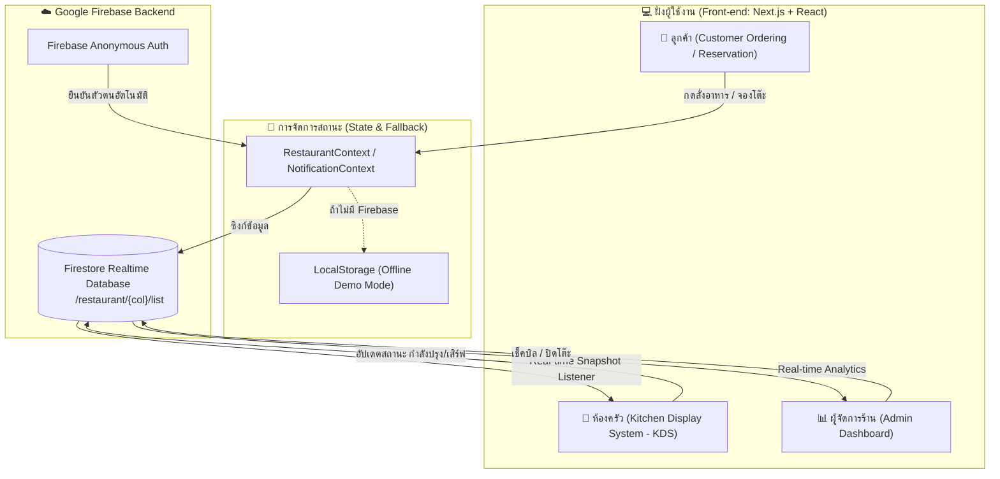

<div align="center">

# 🍽️ อิ่มขนาด (Im-Khanad)
### Modern Authentic Northern Thai Restaurant Management Web Application

[](https://nextjs.org/)
[](https://react.dev/)
[](https://www.typescriptlang.org/)
[](https://tailwindcss.com/)
[](https://firebase.google.com/)
[](https://bun.sh/)

<p align="center">
  <b>ระบบจัดการร้านอาหารสไตล์โมเดิร์นแบบครบวงจร (Full-Stack Realtime Restaurant Platform)</b><br/>
  ผสานประสบการณ์การสั่งอาหารของลูกค้า (Customer Ordering) ระบบจัดการครัวแบบเรียลไทม์ (Kitchen Display System - KDS) และแดชบอร์ดบริหารจัดการสำหรับผู้จัดการร้าน (Admin Dashboard) อย่างลงตัว
</p>

[✨ จุดเด่นฟีเจอร์](#-จุดเด่นและโมดูลระบบ) •
[🏗️ สถาปัตยกรรมระบบ](#️-สถาปัตยกรรมและการไหลของข้อมูล) •
[🎨 ธีมและดีไซน์](#-ธีมและการออกแบบ-warm-culinary-stone) •
[🔒 ความปลอดภัย](#-ความปลอดภัยและ-firestore-rules) •
[🚀 การติดตั้ง](#-การติดตั้งและเริ่มต้นใช้งาน)

---

</div>

<br/>

## 📖 ภาพรวมโปรเจกต์ (Project Overview)

**อิ่มขนาด (Im-Khanad)** เป็นเว็บแอปพลิเคชันที่พัฒนาขึ้นเพื่อจำลองการทำงานจริงของร้านอาหารยุคดิจิทัล โดยเน้นความลื่นไหลในการทำงาน (Real-time Workflow) ความสวยงามคลีนสไตล์ร้านอาหาร Fine & Casual Dining และความปลอดภัยของข้อมูล

ระบบทำงานได้แบบ **Dual-Mode**:
1. **Cloud Real-time Mode**: เชื่อมต่อ **Google Firebase Cloud Firestore** และ **Anonymous Authentication** ทำให้สามารถสั่งอาหารจากมือถือ แล้วรายการเด้งขึ้นหน้าจอครัวของเชฟทันทีโดยไม่ต้องรีเฟรชหน้าจอ
2. **Offline Demo Mode**: หากไม่ได้ตั้งค่า Firebase ระบบมี Fallback ทำงานผ่าน LocalStorage และข้อมูลตัวอย่างอาหารไทยคุณภาพสูง ทำให้ผู้เปิดดูพอร์ตโฟลิโอสามารถทดสอบระบบได้ทันทีทุกที่ทุกเวลา

---

## ✨ จุดเด่นและโมดูลระบบ (Key Modules & Features)

### 1. 📱 ฝั่งลูกค้า: ระบบสั่งอาหารตามโต๊ะ (Customer Portal & Ordering)
- **Digital Menu (`/ordering`)**: แสดงเมนูอาหารไทยพร้อมรูปถ่ายจริง แยกหมวดหมู่อย่างชัดเจน (อาหารจานหลัก, ต้มและแกง, ของหวาน, เครื่องดื่ม)
- **Table Detection & Binding**: เชื่อมต่อหมายเลขโต๊ะผ่าน URL Param เช่น `?table=3` หรือผ่านหน้าจำลองการสแกน QR Code โต๊ะ (`/scan`)
- **Interactive Cart System**: ตะกร้าสินค้าคำนวณราคาสุทธิแบบ Real-time เพิ่ม-ลดจำนวนได้สะดวกรวดเร็ว
- **Table Reservation (`/reservation`)**: แบบฟอร์มจองโต๊ะอาหารล่วงหน้า ระบุวัน, เวลา, จำนวนแขก, และโซนที่นั่ง (Indoor แอร์เย็นฉ่ำ หรือ Outdoor รับลมสวน)
- **Privacy Wireframe Protection**: มีฟิลเตอร์เบลอข้อมูลส่วนตัวและช่องทางติดต่อในหน้าแรก พร้อมสัญลักษณ์จำลอง Wireframe สำหรับใช้เป็นผลงานพอร์ตโฟลิโออย่างปลอดภัย

### 2. 🍳 ฝั่งห้องครัว: หน้าจอแสดงผลออเดอร์ (Kitchen Display System - `/kitchen`)
- **Live Order Stream**: รับออเดอร์ใหม่เข้าครัวทันทีแบบ Real-time ด้วย Firestore Snapshot Listeners
- **Multi-Stage Workflow**: เปลี่ยนสถานะอาหารได้เป็นขั้นตอน
  - `รอดำเนินการ (Pending)` ➔ `กำลังปรุง (Cooking)` ➔ `พร้อมเสิร์ฟ (Served)` ➔ `ชำระเงินแล้ว (Paid)`
- **Audio & Toast Alerts**: มีระบบส่งเสียงแจ้งเตือนและข้อความป๊อปอัปเมื่อมีออเดอร์ใหม่เข้ามา
- **Direct Admin Access**: ปุ่มทางลัดเชื่อมต่อไปยังหน้า Admin Dashboard ได้ในคลิกเดียว

### 3. 📊 ฝั่งผู้จัดการร้าน: แดชบอร์ดสรุปผล (Admin Dashboard - `/admin/dashboard`)
- **Revenue & Business Metrics**: รายงานยอดขายรวมประจำวัน, โต๊ะที่กำลังให้บริการ, และจำนวนออเดอร์ทั้งหมด
- **Active Orders & Table Monitor**: ตรวจสอบสถานะทุกโต๊ะ พร้อมปุ่มเช็คบิลและรับชำระเงิน
- **Reservation Management**: ตารางตรวจสอบรายชื่อผู้สำรองโต๊ะล่วงหน้าพร้อมรายละเอียดครบถ้วน
- **Menu Catalog & Portfolio Protection**: หน้าแสดงรายการเมนูอาหารทั้งหมด โดยทำการ **ล็อกปุ่ม (Disabled)** สำหรับการเพิ่ม, แก้ไข, และลบเมนู เพื่อป้องกันข้อมูลถูกแก้ไขโดยไม่ตั้งใจในการนำเสนอผลงานพอร์ตโฟลิโอ
- **Reset Demo Data**: ปุ่มรีเซ็ตข้อมูลตัวอย่างกลับสู่ค่าตั้งต้นได้ตลอดเวลา

---

## 🏗️ สถาปัตยกรรมและการไหลของข้อมูล (System Architecture)



---

## 🎨 ธีมและการออกแบบ (Warm Culinary Stone)

การออกแบบมุ่งเน้นความสวยงาม สบายตา เรียบหรู และน่าเชื่อถือเหมือนร้านอาหารจริง:
- **โทนสีหลัก (Color Palette)**:
  - พื้นหลังหลัก: `Stone / Warm Rice Paper` (`#FAF7F2`) ให้ความรู้สึกสะอาด สว่าง อบอุ่น สไตล์มินิมอล
  - สีเน้น (Brand Accent): `Warm Amber / Tangerine Orange` (`#EA580C`, `#F59E0B`) สื่อถึงความอร่อยและอาหารไทย
  - การ์ดและคอนเทนเนอร์: พื้นหลังสีขาวบริสุทธิ์ (`bg-white/95`) ตัดขอบด้วยเส้นบางเบา (`border-stone-200/80`)
- **Typography & Responsive**:
  - ฟอนต์ภาษาไทยและอังกฤษอ่านง่าย สบายตา
  - รองรับการแสดงผลทุกขนาดหน้าจอ ตั้งแต่มือถือ (Mobile-First) แท็บเล็ต จนถึงเดสก์ท็อปขนาดใหญ่

---

## 🔒 ความปลอดภัยและ Firestore Rules

ฐานข้อมูล Cloud Firestore ได้รับการตั้งค่าความปลอดภัยแบบ **แบ่งสัดส่วนคอลเลกชัน (Collection Isolation)** เพื่อให้สามารถใช้งานร่วมกับโปรเจกต์อื่น (เช่น ระบบ `points`) ในฐานข้อมูลเดียวกันได้โดยไม่กระทบกัน:

```javascript
rules_version = '2';
service cloud.firestore {
  match /databases/{database}/documents {
    // 🍽️ Restaurant project: อนุญาตให้อ่านและเขียนเฉพาะเอกสารภายใต้ /restaurant
    match /restaurant/{document=**} {
      allow read, write: if request.auth != null;
    }
    
    // 💼 Points project (Portfolio อื่น): แยกพื้นที่อิสระ ปลอดภัย 100%
    match /points/{document=**} {
      allow read, write: if request.auth != null;
    }
  }
}
```

---

## 📁 โครงสร้างโปรเจกต์ (Project Structure)

```text
Restaurant/
├── app/                          # Next.js App Router
│   ├── admin/dashboard/          # หน้าแดชบอร์ดสรุปยอดและจัดการร้าน
│   ├── kitchen/                  # หน้าระบบจัดการคิวอาหารในครัว (KDS)
│   ├── ordering/                 # หน้ารายการเมนูและสั่งอาหารของลูกค้า
│   ├── reservation/              # หน้าระบบจองโต๊ะอาหารล่วงหน้า
│   ├── scan/                     # หน้าจำลองการสแกน QR Code โต๊ะ
│   ├── globals.css               # สไตล์ส่วนกลางและ Tailwind Utilities
│   ├── layout.tsx                # โครงสร้างหลัก (Root Layout & Context Providers)
│   └── page.tsx                  # หน้าแรกของร้าน (Landing Page)
├── components/                   # คอมโพเนนต์ที่ใช้ซ้ำ
│   ├── DishImage.tsx             # คอมโพเนนต์โหลดรูปอาหารแบบ Dynamic Fallback
│   ├── Navbar.tsx                # แถบนำทางด้านบนแบบ Sticky Clean
│   ├── MobileBottomNav.tsx       # แถบเมนูด้านล่างสำหรับมือถือ
│   └── ui/Glass.tsx              # สไตล์การ์ด Glassmorphism สวยงาม
├── context/                      # React Context State Management
│   ├── RestaurantContext.tsx     # จัดการคำสั่งซื้อ โต๊ะ เมนู และการเชื่อมต่อ Firebase
│   └── NotificationContext.tsx   # ระบบเสียงและแจ้งเตือน Toast
├── data/                         # ข้อมูลตั้งต้น (Static & Seed Data)
│   ├── menu.ts                   # รายการอาหารไทยพร้อมรายละเอียดและราคา
│   ├── tables.ts                 # รายการโต๊ะและสถานะความจุ
│   ├── demoOrders.ts             # ออเดอร์จำลองเริ่มต้น
│   ├── demoReservations.ts       # รายการจองโต๊ะจำลอง
│   └── restaurantInfo.ts         # ข้อมูลทั่วไปของร้าน (เวลาเปิด-ปิด, ที่อยู่)
├── public/                       # ไฟล์ Static Assets
│   └── images/dishes/            # รูปภาพอาหารไทยความละเอียดสูง (12 รายการ)
├── .env.example                  # ตัวอย่างการตั้งค่า Environment Variables
├── firestore.rules               # กฎความปลอดภัยของ Firebase Firestore
├── next.config.ts                # การตั้งค่า Next.js
└── package.json                  # Dependencies และ Scripts
```

---

## 🛠️ เทคโนโลยีและเครื่องมือที่ใช้ (Tech Stack)

| หมวดหมู่ | เทคโนโลยี | รายละเอียด |
| :--- | :--- | :--- |
| **Core Framework** | [Next.js 16 (App Router)](https://nextjs.org/) | เซิร์ฟเวอร์และไคลเอ็นต์คอมโพเนนต์ประสิทธิภาพสูง |
| **Language** | [TypeScript](https://www.typescriptlang.org/) | Type Safety เต็มระบบ ป้องกันบั๊กตั้งแต่ตอนพัฒนา |
| **Styling** | [Tailwind CSS 3.4](https://tailwindcss.com/) | ออกแบบ UI คลีน โมเดิร์น และ Responsive |
| **Icons** | [Lucide React](https://lucide.dev/) | ชุดไอคอนสไตล์มินิมอล |
| **Database & Realtime** | [Firebase Cloud Firestore](https://firebase.google.com/) | ฐานข้อมูล NoSQL ซิงก์ข้อมูลสองทิศทางแบบ Real-time |
| **Authentication** | [Firebase Anonymous Auth](https://firebase.google.com/) | เข้าสู่ระบบอัตโนมัติอย่างปลอดภัยโดยไม่ต้องกรอกรหัสผ่าน |
| **Runtime / Tooling** | [Bun](https://bun.sh/) & Node.js | รันและ Build โปรเจกต์ได้อย่างรวดเร็ว |

---

## 🚀 การติดตั้งและเริ่มต้นใช้งาน (Getting Started)

### 1. โคลน Repository
```bash
git clone https://github.com/pleuck11/Restaurant.git
cd Restaurant
```

### 2. ติดตั้ง Dependencies
```bash
bun install
# หรือ npm install / pnpm install
```

### 3. ตั้งค่าตัวแปรสภาพแวดล้อม (Environment Variables)
คัดลอกไฟล์ตัวอย่าง `.env.example` ไปเป็น `.env.local`:
```bash
cp .env.example .env.local
```
จากนั้นเปิดไฟล์ `.env.local` แล้วใส่ค่า Firebase Configuration ของคุณ:
```env
NEXT_PUBLIC_FIREBASE_API_KEY=your_firebase_api_key
NEXT_PUBLIC_FIREBASE_AUTH_DOMAIN=your_project_id.firebaseapp.com
NEXT_PUBLIC_FIREBASE_PROJECT_ID=your_project_id
NEXT_PUBLIC_FIREBASE_STORAGE_BUCKET=your_project_id.firebasestorage.app
NEXT_PUBLIC_FIREBASE_MESSAGING_SENDER_ID=your_messaging_sender_id
NEXT_PUBLIC_FIREBASE_APP_ID=your_firebase_app_id
```

> **หมายเหตุ**: หากไม่ได้ใส่ค่า Firebase Config ระบบจะสลับไปใช้ **Offline Demo Mode** ผ่าน LocalStorage ให้อัตโนมัติ สามารถทดสอบใช้งานได้ทันที

### 4. รันระบบสำหรับการพัฒนา (Dev Server)
```bash
bun run dev
# หรือ npm run dev
```
เปิดเบราว์เซอร์แล้วเข้าสู่: [http://localhost:3000](http://localhost:3000)

### 5. Build สำหรับ Production
```bash
bun run build
bun run start
```

---

## 📱 เส้นทางเข้าชมระบบ (App Routes)

- **หน้าหลัก (Home)**: `/`
- **ระบบสั่งอาหาร (Ordering)**: `/ordering` (หรือ `/ordering?table=1`)
- **หน้าจอห้องครัว (Kitchen KDS)**: `/kitchen`
- **แผงควบคุมผู้จัดการ (Admin Dashboard)**: `/admin/dashboard`
- **ระบบสำรองโต๊ะ (Reservation)**: `/reservation`
- **สแกน QR โต๊ะ (QR Scan Simulator)**: `/scan`

---

## 📄 License & Attribution

- ออกแบบและพัฒนาขึ้นสำหรับนำเสนอเป็นผลงาน **Portfolio Project**
- พัฒนาโดย **pleuck11**
